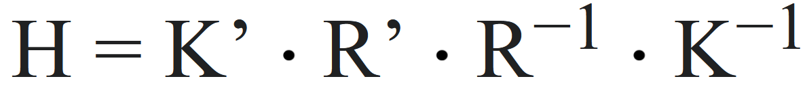

# Drone-Based Terrain Mapping

The procedure is divided into three parts:

1. Feature Extraction
2. Image Stitching
3. Orientation estimation

## Feature Extraction

This step involves extracting features from the images to locate shared points and determine which images must be stiched together and how.

As a feature we use SIFT, since it allows describing images using important points invariant of scale or rotation, even permitting detection of objects from different angles.

The steps to acquire the SIFT descriptors are:

1. Find a keypoint (described by x,y, and σ') by convolving the image with many Difference of Gaussians. Keypoints are located where a Difference is maximized and are described by their position and the size of the Gaussian (σ'), we filter keypoints by using thresholds.
2. Find the orientation using A(x,y), a matrix describing the angle of the images gradients created by HoG.
3. Center a window of size 1.5 σ' and align the window to direction 1 (what is commonly refered as the positive x direction)
4. The window is partitioned into 16 parts.
5. For each partition compute HoG.
6. Concatenate the histograms and normalize the resulting vector.

As for HoG (Histogram of Oriented Gradients), these are computed by the following steps:

1. Obtain the gradient of the image in direction x and y by convolving with [-1,0,1] and [-1,0,1]^T
2. Using these gradients (Gx and Gy) compute the magnitude (R) and orientation (A) of each gradient using R=sqrt(Gx^2+Gy^2) and A=arctan(Gy/Gx)
3. Classify the gradients into 8 according to their orientation.
4. Create a histogram of 8 bins, each bin is the sum of magnitudes in that direction.

## Image Stitching

This step involves the actual stitching.

To do this we compare the keypoints described by SIFT, similar keypoints enable us to determine that two images share common points allong with relative orientation. This allows us to use a linear transformation to align both images and join them into one.

The steps are:

1. Identify common points between each pair of images (registration) using FLANN.
2. Compute the Homography matrix to align the images using the common keypoints.
3. Warp image using the Homography matrix.
4. Stitch the images by .

FLANN involves calculating the Hamming distance between binary descriptors of keypoints and using the distance ratio between the two nearest matches of a keypoint to eliminate false matches by keeping matches which are below a threshold.

The Homography matrix is computed by solving	the following equation:

Where H is the Homography matrix, K' and K are the cameras intrinsic parameter matrices

When it comes to warping we assume planar warping is a good fit because the drone is flying over a field.

## Orientation Estimation

Given the image returned by the previous step we proceed to approximate the orientation of each image.

To do this we

## Final pseudocode

Using the pseudocodes described in the previous sections as functions, the final pseudocode is:

## Sources

1. https://kushalvyas.github.io/stitching.html
2. Pattern recognition course by Domingo Mery
3. https://docs.opencv.org/4.x/d5/d6f/tutorial_feature_flann_matcher.html
4. https://en.wikipedia.org/wiki/Image_stitching
